# What is Image Processing

- Image processing is a method to perform some important operations on an image. In order to get an enhanced high Quality image or to extract the most useful information from that.
- In this processing input is an image and output may be image or characteristics/features associated with that image.

# How Image Input Works In Computer?

- Converts the image into an array of pixel values where the dimension of array depends on the resolution of the image.
- 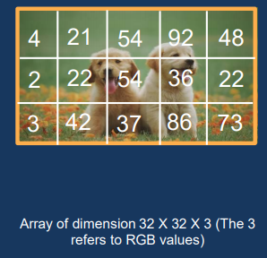

# What is CNN?

- “A feed forward network to process and recognize image data with the grid version”
- 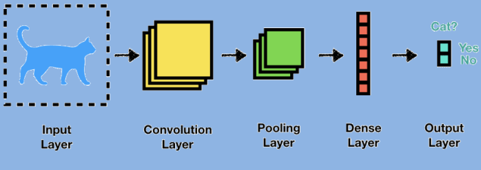

# Layers In CNN

- 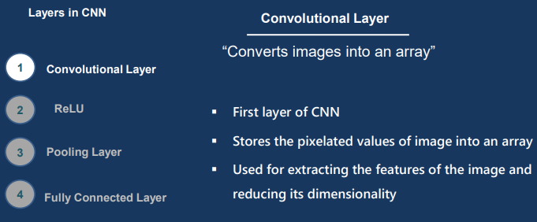
- 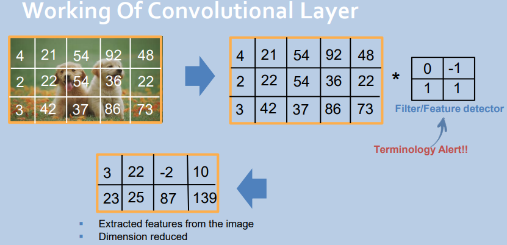
- 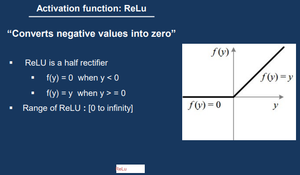
- 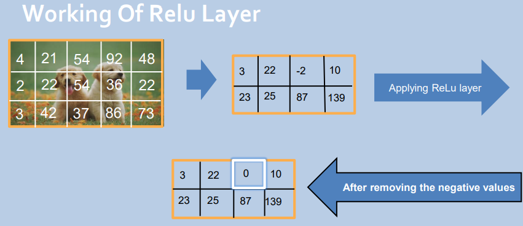
- 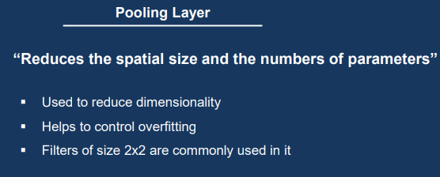
- 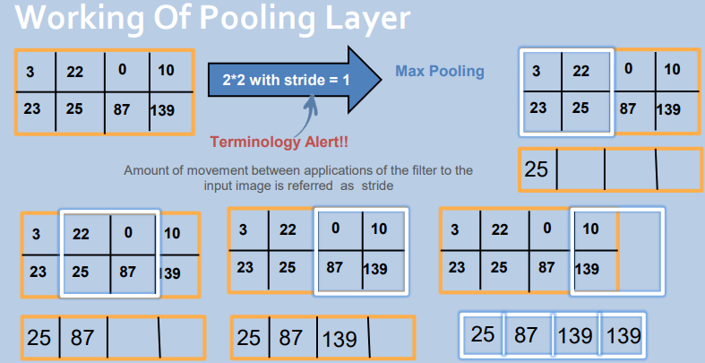
- 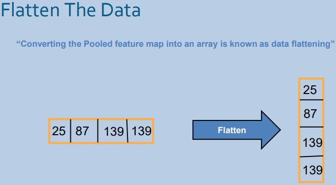
- 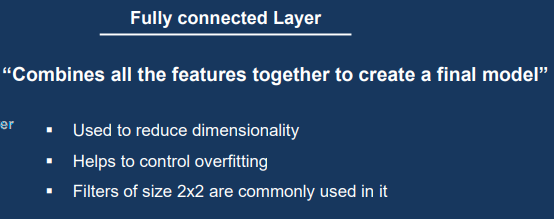
- 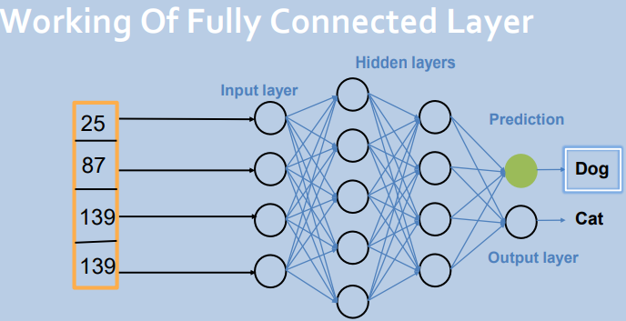
